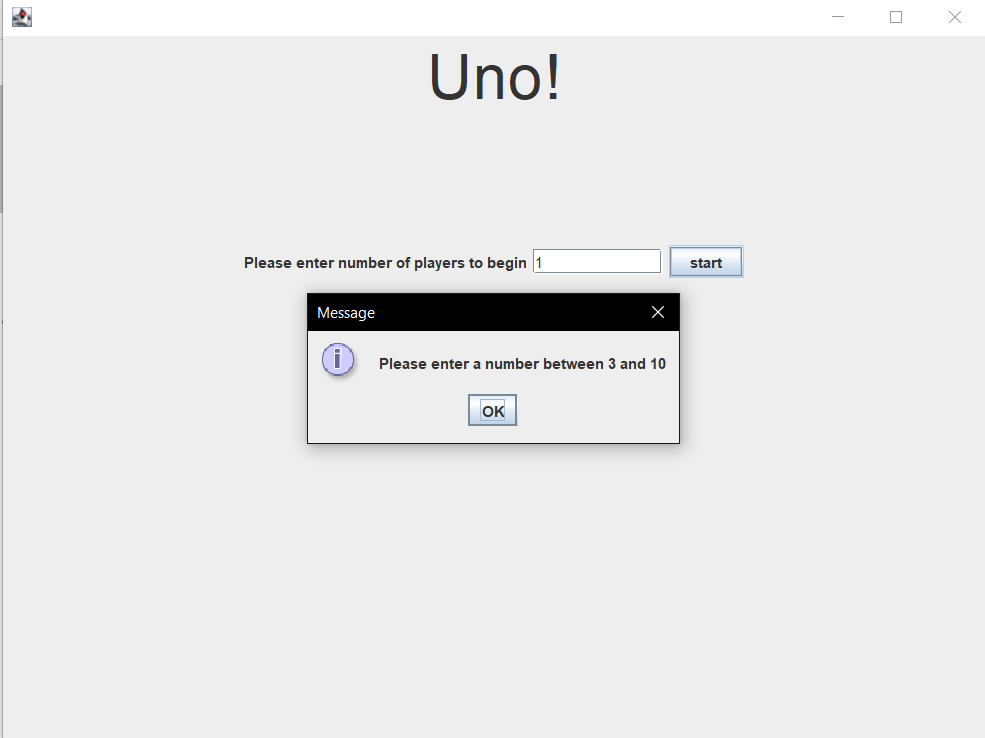
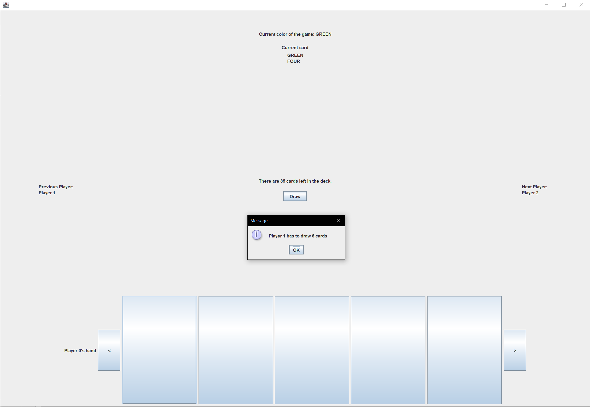

# Prerequisites

java version: 14  
jUnit version:5.4  
preferred IDE: Intellij  
preferred OS: Windows 10

## Installation and Setup

###Get the Uno repository

    git clone https://gitlab.engr.illinois.edu/angl2/fa20-cs242-assignment1
    
###Import JUnit 5.4 in the project.

### Running Uno

Run main method in GameMain class of "main" package.

##Operations and results

###Notice

Resize window may cause the game incompletely display information.

###Start Scene

####input is not number 
In the start view, type "str" in the text field and click start.

 

####invalid player number

In the start scene, type 1 in the text field and click start.

####valid player number
In the start scene, type a number between 3-10 in the text field and click start.
It will pop up a message "go" and take user to main game view.

###main Game View

####intial status
After setting number of player to be 3, if the current order is (0->1->2), the next player
will be player 1 and previous player will be player 2.  

If the order is (0->2->1), the previous player will be player 1 and 
next player will be player 2.  

Notice that the current player's hand, current card, current color are random. 

####invalid card
If the card is not valid to play, it will pop up a message to indicate this.

####valid card(wild)
If the card could be played and it is a wild/wild draw four card, an option pop up window 
will show up for player to choose color.

####valid normal cord
If the card is not a wild card or a wild draw four card, there will be a pop-up message
showing which card the current player has been played. Also, the current player's hand 
will be hidden from screen.  

After that, the current player will become the next player.  
Game will show next player's hand.

####must draw card automatically
Since the current player does not have valid card to play and previous player play
drawTwo/draw four card, the current player has to draw card and skip to next player.

#####use draw button
If current player decides to use draw button, there will be a pop-up message to 
indicate this.  

Then, if the drawn card is able to be played, there will be another pop-up 
message to show the process.

####end scene
When current player has played all the cards, the program will
generate a pop up message. After that, the game will close automatically.

